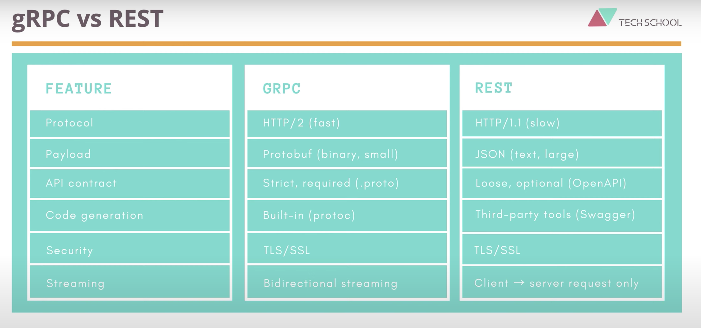

# GRPC Go 使用
##课程目标：构建一个定制PC的APP，其中客户端与服务端通信使用GRPC
# GRPC 4种模式
1. 客户端unary  服务端unary
这种模式很像HTTP

2. 客户端stream  服务端unary

3. 客户端unary  服务端stream

4. 客户端、服务端 bistream

# GRPC vs REST

# unary GRPC & What will we do
1. Define proto service
2. Implement server in Go
> Write server-side code to handle the unary RPC request:save laptop to an in-memory store
3. Implement client in Go
> Write client-side code to call the unary RPC on server.Also write unit test for the interaction between client and server
4. Handle errors and deadline 
> Learn how to set deadline for the request,check for cancellation,handle errors,and return suitable status code to the client

# server-streaming gRPC & What will we do 
1. Define RPC in proto file
> Add the server-streaming RPC to search laptops with filtering
2. Implement server in Go
> Write server-side code to handle the server-streaming RPC request
3. Implement client in Go
> Write client-side code to call the server-streaming RPC on server
4. Write unit test